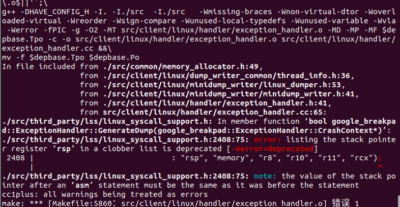

## weston

[weston.ini man page - weston - File Formats | ManKier](https://www.mankier.com/5/weston.ini)

[(108条消息) weston 配置文件去掉状态工具栏_galaxyzwj的博客-CSDN博客_weston.ini](https://blog.csdn.net/zz531987464/article/details/107639015)

## tslib

[(107条消息) tslib 移植与使用_巴斯比男孩的博客-CSDN博客_tslib](https://blog.csdn.net/weixin_42832472/article/details/111303980)

[(108条消息) weston 配置文件去掉状态工具栏_galaxyzwj的博客-CSDN博客_weston.ini](https://blog.csdn.net/zz531987464/article/details/107639015)

## qBreakpad 



```bash
mv -f $depbase.Tpo $depbase.Po
In file included from ./src/common/memory_allocator.h:49,
                 from ./src/client/linux/dump_writer_common/thread_info.h:36,
                 from ./src/client/linux/minidump_writer/linux_dumper.h:53,
                 from ./src/client/linux/minidump_writer/minidump_writer.h:41,
                 from ./src/client/linux/handler/exception_handler.h:41,
                 from src/client/linux/handler/exception_handler.cc:65:
./src/third_party/lss/linux_syscall_support.h: In member function ‘bool google_breakpad::ExceptionHandler::GenerateDump(google_breakpad::ExceptionHandler::CrashContext*)’:
./src/third_party/lss/linux_syscall_support.h:2408:75: error: listing the stack pointer register ‘rsp’ in a clobber list is deprecated [-Werror=deprecated]
 2408 |                              : "rsp", "memory", "r8", "r10", "r11", "rcx");
      |                                                                           ^
./src/third_party/lss/linux_syscall_support.h:2408:75: note: the value of the stack pointer after an ‘asm’ statement must be the same as it was before the statement
cc1plus: all warnings being treated as errors
make: *** [Makefile:5860：src/client/linux/handler/exception_handler.o] 错误 1
```

[(100条消息) qBreakpad dump分析工具编译错误问题_weixin_41330194的博客-CSDN博客](https://blog.csdn.net/weixin_41330194/article/details/124349477)