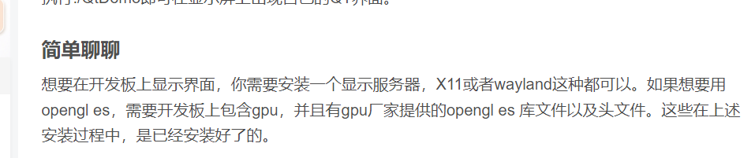

## 交叉编译工具链

[Linaro Releases](http://releases.linaro.org/components/toolchain/binaries/latest-7/aarch64-linux-gnu/)

选择[gcc-linaro-7.5.0-2019.12-x86_64_aarch64-linux-gnu.tar.xz](http://releases.linaro.org/components/toolchain/binaries/latest-7/aarch64-linux-gnu/gcc-linaro-7.5.0-2019.12-x86_64_aarch64-linux-gnu.tar.xz)

不建议选择太高版本，否则glibc版本太高，不被arm开发板linux支持

## QT源码

选择Qt5.15.2，QT5最后一个长期支持版本，qml的库比较全面（建议wget下载）

[Index of /archive/qt/5.15/5.15.2](https://download.qt.io/archive/qt/5.15/5.15.2/)


### 编译基本过程

查看下面博客**QT编译**部分，查看他的编译工程结构设置和qmake.conf，防止污染源码

[(2条消息) Linux下 Qt-5.14.2 交叉编译_錦鈊銀的博客-CSDN博客_linux qt交叉编译](https://blog.csdn.net/jin787730090/article/details/124624798)

编译失败后，如果要重新build，需要把conf.cache缓存清掉

编译完成后，在编译文件夹下可查看conf.summary，有哪些模块测试通过可以编译

如果无硬性需求，按照博客出来的conf.summary能满足基本需求了

### 编译PLUS（OpenGL）

但是如果想增加更多模块，可以选择下载源码，交叉编译模块

但为了不重复造轮子，在pc ubuntu下搭建虚拟arm-ubuntu镜像，通过apt-get下载模块更便捷

apt-get方式需要改动qmake.conf，这一步**很重要**，决定了make过程中的所有问题来源

以opengl模块为例，参照以下博客（建议直接-no-opengl，坑太多），亲测一次过

[(2条消息) QT笔记--嵌入式QT交叉编译与移植(含OpenGL ES2)_中华田园巨龙的博客-CSDN博客_qmake_incdir_opengl](https://blog.csdn.net/weixin_40293570/article/details/117731268)


make像下面这种找不到头文件的问题，apt-get轻易解决

[Qt编译错误“GL/gl.h:No such file or directory”的解决方法](https://www.cnblogs.com/chjbbs/p/6899560.html)


## 编译PLUS（OpenGL + EGL + X11 ?）

OpenGL不支持linuxFb显示框架，需要EGL

[(2条消息) 树莓派4加QT5交叉编译，解决关于eglfs-gbm eglfs-device为no的坑_weixin_45953413的博客-CSDN博客_qt -platform eglfs](https://blog.csdn.net/weixin_45953413/article/details/117381101)

在虚拟机搭建的arm Ubuntu镜像中，下载以下xcb软件包，下载后位于/usr/lib/aarch64-linux-gnu/中

```bash
libx11-dev libxcb1-dev libxext-dev libxi-dev libxcomposite-dev libxcursor-dev libxtst-dev libxrandr-dev libfontconfig1-dev libfreetype6-dev libx11-xcb-dev libxext-dev libxfixes-dev libxi-dev libxrender-dev libxcb1-dev libxcb-glx0-dev libxcb-keysyms1-dev libxcb-image0-dev libxcb-shm0-dev libxcb-icccm4-dev libxcb-sync-dev libxcb-xfixes0-dev libxcb-shape0-dev libxcb-randr0-dev libxcb-render0-dev libxcb-util0-dev libxcb-xinerama0-dev libxcb-xkb-dev libxkbcommon-dev libxkbcommon-x11-dev libxcb-render-util0-dev

```

```bash
libX11-xcb.so.1 libxcb-icccm.so.4 libxcb-image.so.0 libxcb-shm.so.0 libxcb-util.so.1 libxcb-keysyms.so.1 libxcb-randr.so.0 libxcb-render-util.so.0 libxcb-render.so.0 libxcb-shape.so.0 libxcb-sync.so.1 libxcb-xfixes.so.0 libxcb-xinerama.so.0 libxcb-xkb.so.1 libxcb.so.1 libXext.so.6 libX11.so.6 libxkbcommon-x11.so.0 libXau.so.6 libXdmcp.so.6 libbsd.so.0
```

把qt库和xcb库移植到开发板，并设置以下

```bash
#Qt Path
export QT_PATH=/opt/Qt-5.15.2
export LD_LIBRARY_PATH=$LD_LIBRARY_PATH:${QT_PATH}/lib
export QT_QPA_PLATFORM_PATH=${QT_PATH}/plugins/platforms
#Adapt display and touch screen                         
export QT_QPA_PLATFORM=eglfs                            
#export QT_QPA_PLATFORM=linuxfb
export QT_QPA_EVDEV_TOUCHSCREEN_PARAMETERS=/dev/input/event1
export QT_DEBUG_PLUGINS=0                                   
export QT_QPA_FONTDIR=/usr/share/fonts
```

如果是RK3568系列要把相关底层硬件库移植（这里是从原厂固件中提取的库）




