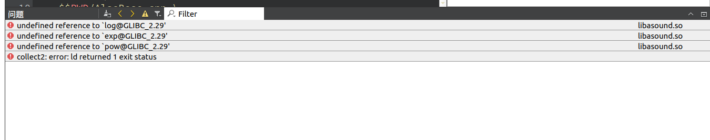
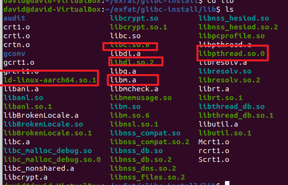
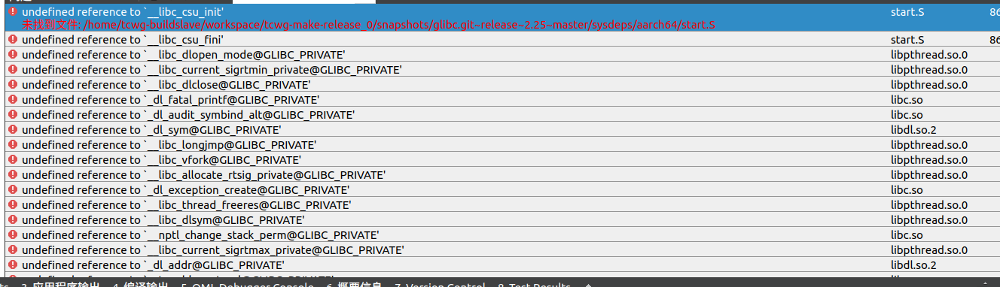

# 编译与移植

版本：alsa-lib-1.1.5.tar.bz2（rk3568 buildroot对应版本）

编译环境：

```bash
david@david-VirtualBox:~$ uname -a
Linux david-VirtualBox 5.15.0-46-generic #49~20.04.1-Ubuntu SMP Thu Aug 4 19:15:44 UTC 2022 x86_64 x86_64 x86_64 GNU/Linux
```

交叉编译器：

```bash
david@david-VirtualBox:~$ aarch64-linux-gnu-gcc -v
Using built-in specs.
COLLECT_GCC=aarch64-linux-gnu-gcc
COLLECT_LTO_WRAPPER=/usr/lib/gcc-cross/aarch64-linux-gnu/9/lto-wrapper
Target: aarch64-linux-gnu
Configured with: ../src/configure -v --with-pkgversion='Ubuntu 9.4.0-1ubuntu1~20.04.1' --with-bugurl=file:///usr/share/doc/gcc-9/README.Bugs --enable-languages=c,ada,c++,go,d,fortran,objc,obj-c++,gm2 --prefix=/usr --with-gcc-major-version-only --program-suffix=-9 --enable-shared --enable-linker-build-id --libexecdir=/usr/lib --without-included-gettext --enable-threads=posix --libdir=/usr/lib --enable-nls --with-sysroot=/ --enable-clocale=gnu --enable-libstdcxx-debug --enable-libstdcxx-time=yes --with-default-libstdcxx-abi=new --enable-gnu-unique-object --disable-libquadmath --disable-libquadmath-support --enable-plugin --enable-default-pie --with-system-zlib --without-target-system-zlib --enable-libpth-m2 --enable-multiarch --enable-fix-cortex-a53-843419 --disable-werror --enable-checking=release --build=x86_64-linux-gnu --host=x86_64-linux-gnu --target=aarch64-linux-gnu --program-prefix=aarch64-linux-gnu- --includedir=/usr/aarch64-linux-gnu/include
Thread model: posix
gcc version 9.4.0 (Ubuntu 9.4.0-1ubuntu1~20.04.1)
```

编译步骤：（无报错）

```bash
CC=aarch64-linux-gnu-gcc
./configure --prefix=[目标路径] --host=aarch64-linux-gnu
make
make install
```

代码中链接出现问题：（重点）



我的理解：libasound.so链接不到c库。于是：

```bash
# 分析需要的链接库
$ objdump -x libasound.so | grep NEEDED 
  NEEDED               libm.so.6
  NEEDED               libdl.so.2
  NEEDED               libpthread.so.0
  NEEDED               libc.so.6
  NEEDED               ld-linux-aarch64.so.1
  
  
# 查看交叉编译器支持的glibc版本，貌似最高支持2.25，而我们需要2.29
$ strings /opt/gcc-linaro-7.5.0-2019.12-x86_64_aarch64-linux-gnu/aarch64-linux-gnu/libc/lib/libm.so.6 | grep "GLIBC" 
GLIBC_2.17
GLIBC_2.18
GLIBC_2.23
GLIBC_2.24
GLIBC_2.25
GLIBC_PRIVATE
fputs@@GLIBC_2.17
__strtold_nan@@GLIBC_PRIVATE
errno@@GLIBC_PRIVATE
__cxa_finalize@@GLIBC_2.17
stderr@@GLIBC_2.17
qsort@@GLIBC_2.17
GLIBC_2.24
__strtod_nan@@GLIBC_PRIVATE
lgammal@@GLIBC_2.23
memset@@GLIBC_2.17
lgammaf@@GLIBC_2.23
lgamma@@GLIBC_2.23
lgammaf@GLIBC_2.17
GLIBC_2.18
GLIBC_2.25
fwrite@@GLIBC_2.17
__strtof_nan@@GLIBC_PRIVATE
lgamma@GLIBC_2.17
__assert_fail@@GLIBC_2.17
lgammal@GLIBC_2.17
```

于是下载glibc-2.35（>2.29）并交叉编译(注意在glibc-2.35目录之外config和make)

```bash
$ CC=aarch64-linux-gnu-gcc
$ ./glibc-2.35/configure --prefix=[目标路径] --host=aarch64-linux-gnu
$ make
$ make install
```

make过程中出现如下报错（可能是支持文档方面），但不影响安装

```bash
...
/usr/lib/gcc-cross/aarch64-linux-gnu/9/../../../../aarch64-linux-gnu/bin/ld: 找不到 -lstdc++
collect2: error: ld returned 1 exit status
make[2]: *** [../Rules:193：/home/david/glibc-2.29/support/links-dso-program] 错误 1
make[2]: 离开目录“/home/david/glibc-2.29/glibc-2.29/support”
make[1]: *** [Makefile:258：support/others] 错误 2
make[1]: 离开目录“/home/david/glibc-2.29/glibc-2.29”
make: *** [Makefile:9：all] 错误 2
```

在[目标路径]/lib目录下找到需要的几个库文件，放到工程目录下



出现了很多奇怪错误



思考：

1、是否是交叉编译器的问题？QT某些环境变量没设置到？

- 尝试使用致远的交叉编译器（同样支持2.29版本c库）到qt，问题未解决，此外还发现该编译器无法链接到c++头文件
- 尝试使用新版本gcc-linaro-...-x86_64_aarch64_linux-gnu，但是已经最新；
- 配置相关环境变量LD_LIBRARY_PATH，无效

2、参考blog

[(103条消息) undefined reference to symbol ‘pow@@GLIBC_2.2.5 编译错误解决方法_猪哥-嵌入式的博客-CSDN博客](https://blog.csdn.net/u012351051/article/details/109097970)

回头一看其实就是没链接到几个2.29版本的数学函数（log、exp、pow），所以只需要移植libm.so即可

而本地gcc编译器已经支持2.29版本c库，不需要额外编译
