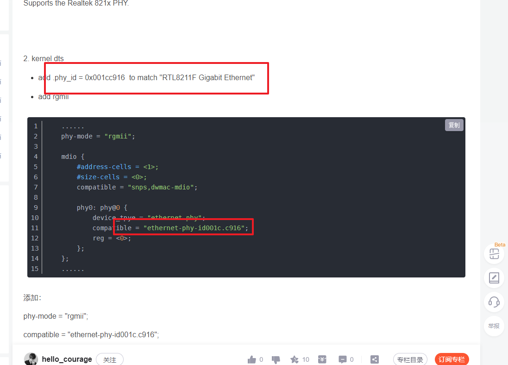
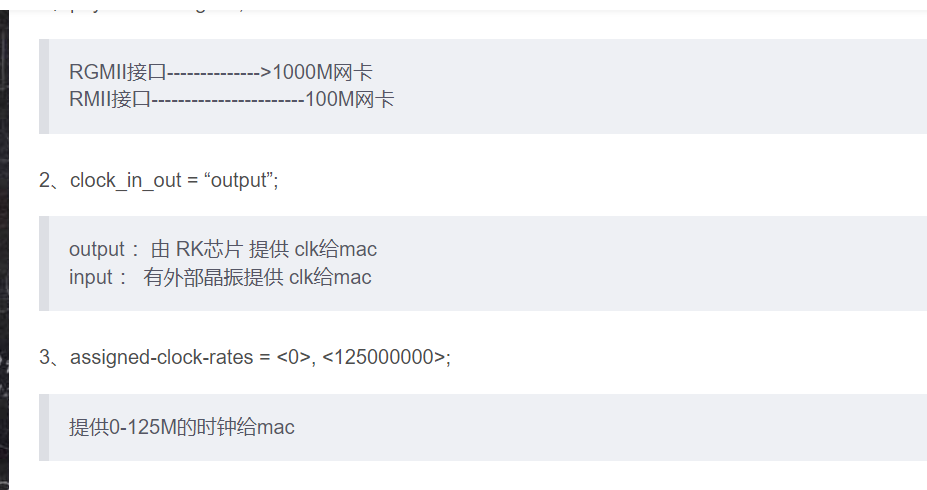
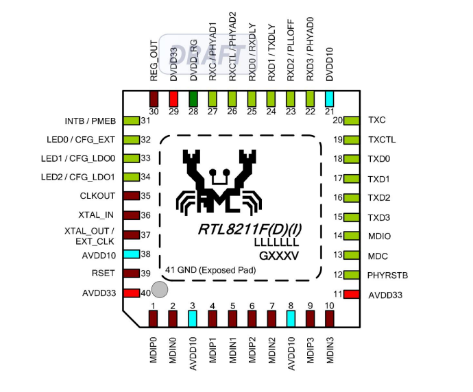
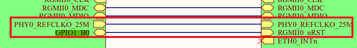

[(95条消息) RTL8211F PHY linux配置_hello_courage的博客-CSDN博客_rtl8211f](https://armlinux.blog.csdn.net/article/details/117715259?spm=1001.2101.3001.6661.1&utm_medium=distribute.pc_relevant_t0.none-task-blog-2~default~CTRLIST~PayColumn-1-117715259-blog-124299669.pc_relevant_default&depth_1-utm_source=distribute.pc_relevant_t0.none-task-blog-2~default~CTRLIST~PayColumn-1-117715259-blog-124299669.pc_relevant_default&utm_relevant_index=1)



[(95条消息) rk3568以太网调试_要不要买菜！的博客-CSDN博客](https://blog.csdn.net/qq_38312843/article/details/122957389?spm=1001.2101.3001.6650.3&utm_medium=distribute.pc_relevant.none-task-blog-2~default~CTRLIST~Rate-3-122957389-blog-124299669.pc_relevant_default&depth_1-utm_source=distribute.pc_relevant.none-task-blog-2~default~CTRLIST~Rate-3-122957389-blog-124299669.pc_relevant_default&utm_relevant_index=6)




查看驱动

```bash
/sys/devices/platform/*
```

# 详细配置

```bash
/ {
    vcc_phy0: vcc-phy0-regulator {
        compatible = "regulator-fixed";
        regulator-name = "vcc_phy0";
        regulator-always-on;
        regulator-boot-on;
    };
    vcc_phy1: vcc-phy1-regulator {
        compatible = "regulator-fixed";
        regulator-name = "vcc_phy1";
        regulator-always-on;
        regulator-boot-on;
    };
};

&mdio0 {
    rgmii_phy0: phy@0 {
        compatible = "ethernet-phy-id001c.c916";
        reg = <0x1>;
        clocks = <&cru CLK_MAC0_OUT>;
    };
};

&mdio1 {
    rgmii_phy1: phy@0 {
        compatible = "ethernet-phy-id001c.c916";
        reg = <0x3>;
        clocks = <&cru CLK_MAC1_OUT>;
    };
};

/* @fe2a0000, this is real gmac1 sortted by address */
&gmac0 {
	status = "okay";
	
	phy-handle = <&rgmii_phy0>;
	phy-mode = "rgmii"; /* 1000M网卡 ... rmii -> 100M网卡 ；pinctrl-0字段必须与此字段匹配*/
	
	clock_in_out = "output"; //output为GMAC输出，input为phy提供给gmac
	assigned-clocks = <&cru SCLK_GMAC0_RX_TX>, <&cru SCLK_GMAC0>, <&cru CLK_MAC0_OUT>; /* mac时钟源*/
	/* assigned-clocks = <cru SCLK_GMAC0_RX_TX>, <&cru SCLK_GMAC0>; */
	assigned-clock-parents = <&cru SCLK_GMAC0_RGMII_SPEED>; /* 如果是output，需要选择mac父时钟 */
	/* assigned-clocks-parents = <&cru SCLK_GMAC0_RGMII_SPEED>, <&gmac0_clkin> */
	assigned-clock-rates = <0>, <125000000>, <25000000>; /* 提供125M时钟给mac */
	
	snps,reset-gpio = <&gpio1 RK_PB0 GPIO_ACTIVE_LOW>; /*  /* 默认GPIO1_B0 */
	snap,reset-active-low; /* 低电平有效 */
	/* Reset time is 20ms, 100ms for rt18211f */
	snps, reset-delays-us = <0, 20000, 140000>; /* 复位前延时0ms，拉低维持20ms, 拉高延时140ms */
	
	pinctrl-names = "default";
	pinctrl-0 = <&gmac0_miim
        &gmac0_tx_bus2_level3
        &gmac0_rx_bus2
        &gmac0_rgmii_clk_level2
        &gmac0_rgmii_bus_level3
        &eth0_pins>;
	
	tx_delay = <0x30>;
	rx_delay = <0x10>;
};
	
```





1、clk是rk芯片还是外部晶振

2、复位gpio是哪一个？

3、是否需要修改电压域

4、复位时间