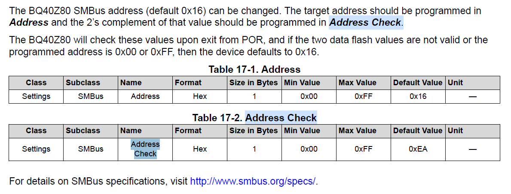
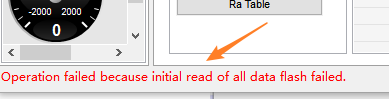
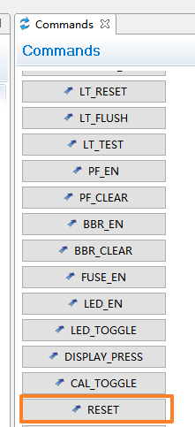
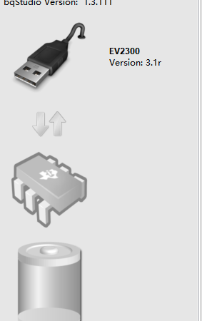
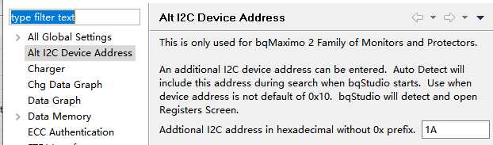
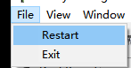
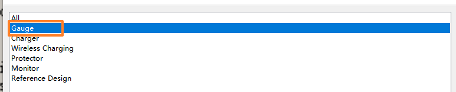
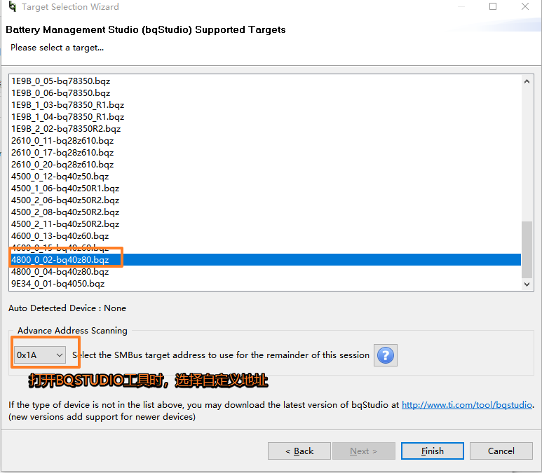

# BQ40Z80（TI）

ti开源社区bq40z50驱动：（kernel4-4）

[kernel-4.4/drivers/power/bq40z50 at release · tibms/kernel-4.4 (github.com)](https://github.com/tibms/kernel-4.4/tree/release/drivers/power/bq40z50)

ti开源社区bq40z50驱动：（kernel3.15）

[navado/bq40z50: backport of bq40z50 for Linux 3.15 from official release https://github.com/tibms/kernel-4.4/tree/release/drivers/power/bq40z50](https://github.com/navado/bq40z50)

bq40z80采用smbus连接

**问题：i2cdetect 检测不到bq40z50评估板？**

smbus工作频率是10-100kHz，i2c工作频率可达400KHz

所以留意设备树文件，i2c总线的配置频率

## 上位机使用

**Battery Management Studio**(BQStudio)

由于要级联两个电池，但是两个电池的管理芯片的地址是一样的（默认是0x16），会造成冲突，所以要修改

暂时未知寄存器修改方法，所以使用上位机修改

Data Memory - Settings - SMBus

默认0x16和补码0xEA，七位地址为0x0b

修改为0x1A和补码0xE6，七位地址为0x0d

修改后，点击右上角write_all，表格已经改变了，但并不意味着修改成功，有可能线没接对、电脑的USB口故障或者被占用等问题导致写入失败。正确的方法是注意左下角是否有红色日志，出现该提示，说明写入可能不成功，只有没有红色日志时，才能说明写入成功了

手册中提到，"The BQ40Z80 will check these value upon exit from POR"，POR即Power Reset电源复位。

在软件右侧的Commands按钮栏中，找到RESET并点击，如果上位机失去连接，说明地址已经修改成功

上方Window-Preferences

左上角File-Restart重新打开上位机

选择Gauge（否则无法设置自定义设备地址）

打开后如果连接成功说明已修改完成

参考链接：[BQ40Z50-R2: SMBus地址修改 - 电源管理论坛 - 电源管理 - E2E™ 设计支持 (ti.com)](https://e2echina.ti.com/support/power-management/f/power-management-forum/215305/bq40z50-r2-smbus)

