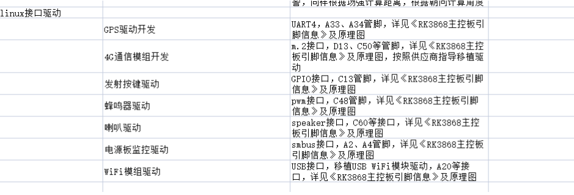
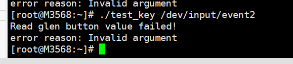

## GPIO按键

[(102条消息) Linux 驱动开发 四十九：Linux 自带按键驱动程序_lqonlylove的博客-CSDN博客_config_keyboard_gpio](https://blog.csdn.net/OnlyLove_/article/details/122815614?ops_request_misc=%7B%22request%5Fid%22%3A%22166305439816800192288027%22%2C%22scm%22%3A%2220140713.130102334..%22%7D&request_id=166305439816800192288027&biz_id=0&utm_medium=distribute.pc_search_result.none-task-blog-2~all~top_positive~default-1-122815614-null-null.142^v47^new_blog_pos_by_title,201^v3^control_1&utm_term=linux按键驱动&spm=1018.2226.3001.4187)

meke menuconfig 配置

```bash
GPIO Buttons
```

设备树配置说明，以GPIO1_PD0为例，由于默认是GPIO，所以直接增加key节点，并配置pinctrl即可

```bash
#include <dt-bindings/gpio/gpio.h>
#include <dt-bindings/pinctrl/rockchip.h>

/ { 
	gpio_keys: gpio_keys {
		compatible = "gpio-keys";		   
		pinctrl-name = "default";
		pinctrl-0 = <&myBtn>;

		key1@1 {
			label = "USER-KEY1";
			linux,code = <114>;
			gpios = <&gpio1 RK_PD0 GPIO_ACTIVE_LOW>;
			gpio-key,wakeup;

			gpio-controller;
		};
	};
};


&pinctrl {
	gpio_keys {

		myBtn: myBtn {
			rockchip,pins = <1 RK_PD0 RK_FUNC_GPIO &pcfg_pull_up>;
		};
	};
};
```

参考网上例程1：[(101条消息) Linux学习笔记（17.4）——基于gpio中断的按键驱动_glen_cao的博客-CSDN博客_linux 按键中断驱动](https://blog.csdn.net/glen_cao/article/details/122604445)



报错，因为该例程用的不是input子事件event

参考网上例程2：

```bash
#include <linux/input.h>                                                                                                                                                                                     
#include <sys/types.h>
#include <sys/stat.h>
#include <unistd.h>
#include <stdlib.h>
#include <fcntl.h>
#include <stdio.h>

#define INPUT_DEV "/dev/input/event2"

int main(int argc, char * const argv[])
{
    int fd = 0;

    struct input_event event;

    int ret = 0;

    fd = open(INPUT_DEV, O_RDONLY);

    while(1){
        ret = read(fd, &event, sizeof(event));
        if(ret == -1) {
            perror("Failed to read.\n");
            exit(1);
        }

        if(event.type != EV_SYN) {
            printf("type:%d, code:%d, value:%d\n", event.type, event.code, event.value);
        }
    }   

    return 0;
}
```

同步阻塞读取

参考网上例程3：[(101条消息) Linux键盘输入读取_SGuniver_22的博客-CSDN博客_linux获取键盘输入](https://blog.csdn.net/SGuniver_22/article/details/111186317)

**异步线程读取，回调，比同步读取更好**

```bash
[root@M3568:~]# ./thr_key 
key/114 type/1
key/114 type/2
key/114 type/2
key/114 type/2
key/114 type/2
key/114 type/2
key/114 type/2
key/114 type/2
```


# GPS

meke menuconfig 配置

```bash
SERIAL_DEV_BUS
GNSS

可选：
GNSS_CMDLINE_SERIAL 
GNSS_SIRF_SERIAL
GNSS_UBX_SERIAL
```

设备树配置说明

```bash
kernel/Documentation/devicetree/bindings/gnss
```

[gnss.txt](../doc/gnss/gnss.txt)

[sirfstar.txt](../doc/gnss/sirfstar.txt)

[u-blox.txt](../doc/gnss/u-blox.txt)

注：采用ATGM332D-5N，串口通信AT协议，不需要配置驱动


## 扬声器

系统自带驱动，make menuconfig配置Sound card support，命令行调用即可

```bash
#播放
aplay canon.wav
#后台播放
aplay canon.wav &
#结束后台播放
killall aplay
# 调整音量为50%
# amixer cset numid=3 [value]
amixer cset numid=3 50
```

### amixer说明

WAV = 头信息 + PCM（最RAW的音频数据）

```bash
#(1)
aplay -t raw -c 1 -f S16_LE -r 8000 canon.pcm
#-t: type raw表示是PCM
#-c: channel 1
#-f S16_LE: Signed 16bit-width Little-Endian
#-r: sample rate 8000

#(2)
aplay canon.wav
```

```bash
# 显示接口函数
[root@M3568:~]# amixer controls
numid=3,iface=MIXER,name='Master Playback Volume'
numid=2,iface=MIXER,name='Capture MIC Path'
numid=1,iface=MIXER,name='Playback Path'

# 获取某一接口的配置信息
[root@M3568:~]# amixer cget numid=2,iface=MIXER,name='Capture MIC Path'
numid=2,=MIXER,name='Capture MIC Path'
  ; type=ENUMERATED,access=rw------,values=1,items=4
  ; Item #0 'MIC OFF'
  ; Item #1 'Main Mic'
  ; Item #2 'Hands Free Mic'
  ; Item #3 'BT Sco Mic'
  : values=2
  
# 获取全部接口的配置参数
[root@M3568:~]# amixer contents
numid=3,iface=MIXER,name='Master Playback Volume' # 专用于设置音量
  ; type=INTEGER,access=rw---RW-,values=2,min=0,max=100,step=0
  : values=10,10
  | dBscale-min=-30.00dB,step=0.30dB,mute=0
numid=2,iface=MIXER,name='Capture MIC Path' # SPEAKER
  ; type=ENUMERATED,access=rw------,values=1,items=4
  ; Item #0 'MIC OFF'
  ; Item #1 'Main Mic'
  ; Item #2 'Hands Free Mic'
  ; Item #3 'BT Sco Mic'
  : values=2
numid=1,iface=MIXER,name='Playback Path'
  ; type=ENUMERATED,access=rw------,values=1,items=11
  ; Item #0 'OFF'
  ; Item #1 'RCV'
  ; Item #2 'SPK'
  ; Item #3 'HP'
  ; Item #4 'HP_NO_MIC'
  ; Item #5 'BT'
  ; Item #6 'SPK_HP'
  ; Item #7 'RING_SPK'
  ; Item #8 'RING_HP'
  ; Item #9 'RING_HP_NO_MIC'
  ; Item #10 'RING_SPK_HP'
  : values=3
  
  # 设置某一接口的value=2
  [root@M3568:~]# amixer cset numid=2,iface=MIXER,name='Capture MIC Path' 2
numid=2,iface=MIXER,name='Capture MIC Path'
  ; type=ENUMERATED,access=rw------,values=1,items=4
  ; Item #0 'MIC OFF'
  ; Item #1 'Main Mic'
  ; Item #2 'Hands Free Mic'
  ; Item #3 'BT Sco Mic'
  : values=2

  
[root@M3568:~]# amixer help
Usage: amixer <options> [command]

Available options:
  -h,--help       this help
  -c,--card N     select the card
  -D,--device N   select the device, default 'default'
  -d,--debug      debug mode
  -n,--nocheck    do not perform range checking
  -v,--version    print version of this program
  -q,--quiet      be quiet
  -i,--inactive   show also inactive controls
  -a,--abstract L select abstraction level (none or basic)
  -s,--stdin      Read and execute commands from stdin sequentially
  -R,--raw-volume Use the raw value (default)
  -M,--mapped-volume Use the mapped volume

Available commands:
  scontrols       show all mixer simple controls
  scontents	  show contents of all mixer simple controls (default command)
  sset sID P      set contents for one mixer simple control
  sget sID        get contents for one mixer simple control
  controls        show all controls for given card
  contents        show contents of all controls for given card
  cset cID P      set control contents for one control
  
  #保存修改的数据
  alsactl store
```

### alsa说明

选项	功能
-D,–device	指定声卡设备, 默认使用 default
-l,–list-devices	列出当前所有声卡
-t,–file-type	指定播放文件的格式, 如 voc,wav,raw, 不指定的情况下会去读取文件头部作识别
-c,–channels	指定通道数
-f,–format	指定采样格式
-r,–rate	采样率
-d,–duration	指定播放的时间
–period-size	指定 period size
–buffer-size	指定 buffer size

/drivers/input/misc/rotary_encoder.c
