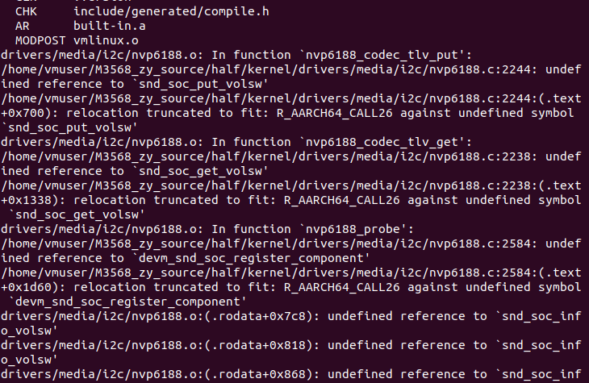
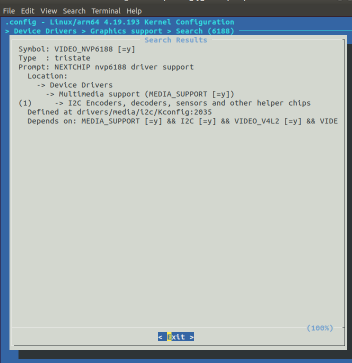
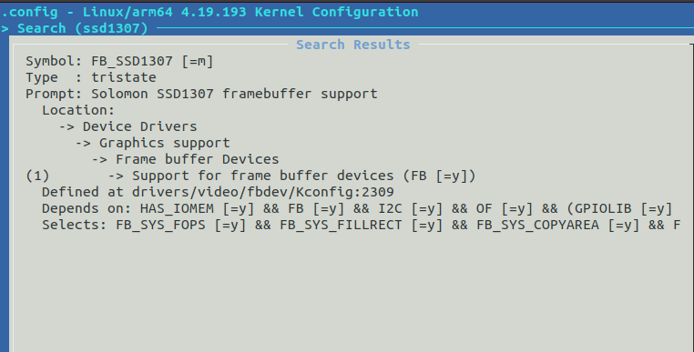
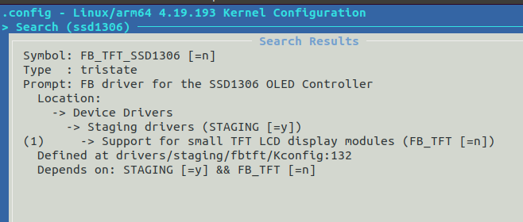
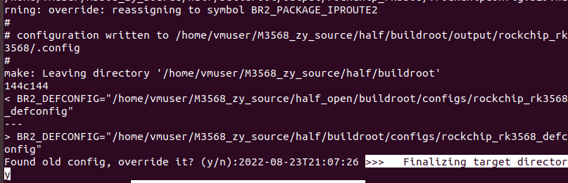
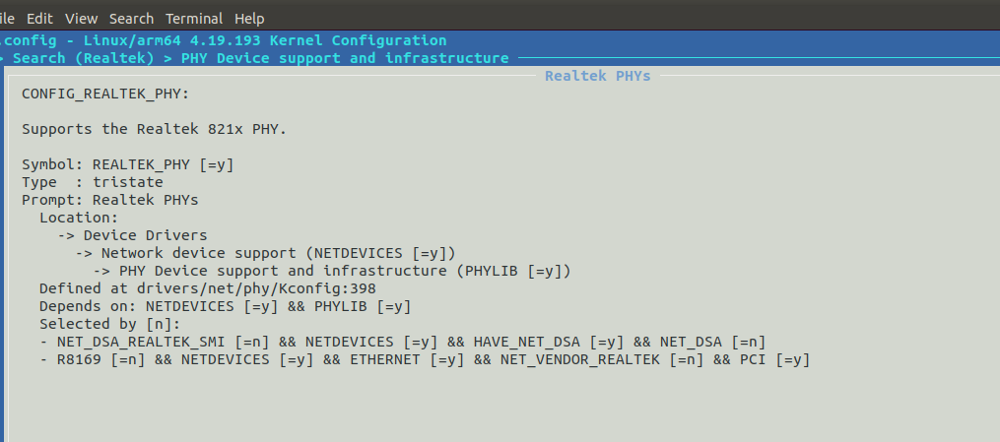
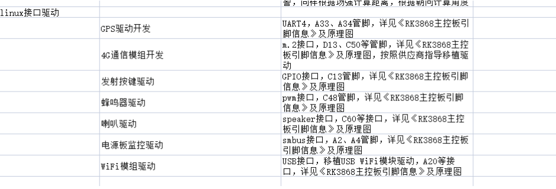

- 在使用 make modules 命令编译内核时，所有设置 为的项将被编译。make modules 结束后可以使用下面的命令安装内核中的可加载模块文 件到一个指定的目录：  make modules_install INSTALL_MOD_PATH=/home/usr/modules 

- 使用 make 命令编译内核相当于执行 make zImage 和 make modules 两个命令

- 编译内核时默认使用

  ```bash
  $kernel$ ./arch/arm64configs/rockchip_linux_defconfig
  ```

  故重新配置时

  ```bash
  $kernel$ cp ./arch/arm64/configs/rockchip_linux_defconfig ./.config 
  ```

  更新配置

  ```bash
  $kernel$ cp ./.config  ./arch/arm64/configs/rockchip_linux_defconfig 
  ```


## 移除内核模块

注意：移除某个模块以后，再次加载时需要重新配置

| 模块                                         | 编译是否通过 | 运行是否正常              | 搜索字段             | 概要           |
| -------------------------------------------- | ------------ | ------------------------- | -------------------- | -------------- |
| CAN bus subsystem support                    | √            | √                         | CAN                  |                |
| Bluetooth subsystem support                  | √            | √                         | BT                   |                |
| PPP (point-to-point protocol) support        | √            | √                         | PPP                  | 电话服务之类的 |
| Wireless LAN （WLAN）                        | √            | √                         | WLAN                 | WiFi之类的服务 |
| KeyBoards                                    | √            | √                         | INPUT_KEYBOARD       |                |
| Mice                                         | √            | √                         | INPUT_MOUSE          |                |
| SPI support                                  | √            | √                         | SPI                  |                |
| Sound card support                           | *            | √                         | SOUND                |                |
| MMC/SD/SDIO card support                     | √            | ×（直接无法进入文件系统） |                      |                |
| NFS client support & NFS server support      | √            | √                         | NFS_FS、NFSD         |                |
| ISO 9660 CDROM file system support           | √            | √                         | ISO9660_FS           |                |
| Wireless                                     | √            | √                         | WIRELESS             | 无线的         |
| RF switch subsystem support （蓝牙wifi控制） | √            | √                         | RFKILL               | WIFI相关       |
| Cameras/video grabbers support               |              |                           | MEDIA_CAMERA_SUPPORT | V4L2相关       |
| HDMI CEC support                             |              |                           | MEDIA_CEC_SUPPORT    | HDMI           |
| Serial ATA and Parallel ATA drivers (libata) |              |                           | ATA                  | ATA控制器      |

 (Sound card support移除后出现以下问题)



解决办法：搜索nvp6818，移除该模块即可



## 增加模块

1、make menuconfig加入模块

2、修改设备树

```bash
$kernel$ ./arch/arm64/boot/dts/rockchip/rk3568*
```

详询

```bash
$kernel$ ./Documentation/devicetree/bingdings/*
```

```bash
dmesg | tail -n 20  # 查阅内核运行打印信息
```

3、编译+烧录boot.img

### 例：SSD1306 IIC驱动

1、



*注：以下是spi驱动*



选择M外部加载或Y写进内核都可

2、

```bash
$kernel$ cat Documentation/devicetree/bindings/display/ssd1307fb.txt # 查看设备树修改帮助
```

```bash
* Solomon SSD1307 Framebuffer Driver

Required properties:
  - compatible: Should be "solomon,<chip>fb-<bus>". The only supported bus for
    now is i2c, and the supported chips are ssd1305, ssd1306, ssd1307 and
    ssd1309.
  - reg: Should contain address of the controller on the I2C bus. Most likely
         0x3c or 0x3d
  - pwm: Should contain the pwm to use according to the OF device tree PWM
         specification [0]. Only required for the ssd1307.
  - solomon,height: Height in pixel of the screen driven by the controller
  - solomon,width: Width in pixel of the screen driven by the controller
  - solomon,page-offset: Offset of pages (band of 8 pixels) that the screen is
    mapped to.

Optional properties:
  - reset-gpios: The GPIO used to reset the OLED display, if available. See
                 Documentation/devicetree/bindings/gpio/gpio.txt for details.
  - vbat-supply: The supply for VBAT
  - solomon,segment-no-remap: Display needs normal (non-inverted) data column
                              to segment mapping
  - solomon,com-seq: Display uses sequential COM pin configuration
  - solomon,com-lrremap: Display uses left-right COM pin remap
  - solomon,com-invdir: Display uses inverted COM pin scan direction
  - solomon,com-offset: Number of the COM pin wired to the first display line
  - solomon,prechargep1: Length of deselect period (phase 1) in clock cycles.
  - solomon,prechargep2: Length of precharge period (phase 2) in clock cycles.
                         This needs to be the higher, the higher the capacitance
                         of the OLED's pixels is

[0]: Documentation/devicetree/bindings/pwm/pwm.txt

Examples:
ssd1307: oled@3c {
        compatible = "solomon,ssd1307fb-i2c";
        reg = <0x3c>;
        pwms = <&pwm 4 3000>;
        reset-gpios = <&gpio2 7>;
        reset-active-low;
};

ssd1306: oled@3c {
        compatible = "solomon,ssd1306fb-i2c";
        reg = <0x3c>;
        pwms = <&pwm 4 3000>;
        reset-gpios = <&gpio2 7>;
        reset-active-low;
        solomon,com-lrremap;
        solomon,com-invdir;
        solomon,com-offset = <32>;
};
```

参照描述，修改对应设备树

```bash
$kernel$ vi arch/arm64/boot/dts/rockchip/rk3568-evb1-ddr4-v10.dtsi # 修改对应设备树
```

找到&i2c4 (设备通过SCL4 SDA4连接到第四条I2C总线)

```bash
&i2c4 {
	clock-frequency = <400000>;
	pinctrl-0 = <&i2c4m1_xfer>;
	status = "okay";
	
	rtc_85063: rtc_pcf85063@51 {
		compatible = "nxp,pcf85063";
		reg = <0x51>;
	};
# 以下是新增内容
# 3c地址位，参考设备硬件连接地址（板上的I2C地址（0x78）是加上了第零位读写位后的数值，实际上是0x3c）
# 128 个像素宽。没有该项默认为96
# 64 个像素高。没有该项默认为16
	ssd1306: oled@3c {
		compatible = "solomon,ssd1306fb-i2c";
		reg = <0x3c>; 
		solomon,width = <128>; 
		solomon,height = <64>; 
		status = "okay";
	};
# 以上是新增内容
};
```

3、更新设备树后烧录内核，然后加载驱动

```bash
[  110.508612] ssd1307fb 4-003c: fb0: Solomon SSD1307 framebuffer device registered, using 1024 bytes of video memory
[  329.035638] ssd1307fb 4-003c: Looking up vbat-supply from device tree
[  329.035661] ssd1307fb 4-003c: Looking up vbat-supply property in node /i2c@fe5d0000/oled@3c failed
[  329.066513] ssd1307fb 4-003c: fb0: Solomon SSD1307 framebuffer device registered, using 1024 bytes of video memory
```

出现Framebuffer帧缓冲设备接口，调用即可

```bash
[root@M3568:~]# ls /dev/fb*
/dev/fb0
```

[Framebuffer应用例程](../src/iic_oled_fb.md)

[Linux framebuffer简介及操作_12946289的技术博客_51CTO博客](https://blog.51cto.com/u_12956289/2916962)

[一个简单的framebuffer的显示使用例子_蓝白天际线的博客-CSDN博客](https://blog.csdn.net/u011006622/article/details/73321535)


## 移除buildroot模块

| 模块      | 编译是否通过 | 运行是否正常 |
| --------- | ------------ | ------------ |
| libnfs    |              |              |
| can-utils |              |              |
|           |              |              |
|           |              |              |
|           |              |              |
|           |              |              |
|           |              |              |
|           |              |              |
|           |              |              |
|           |              |              |
|           |              |              |
|           |              |              |



2022/09/09 phy 驱动



查阅代码后得知兼容8201系列，待验证


未来开发：


