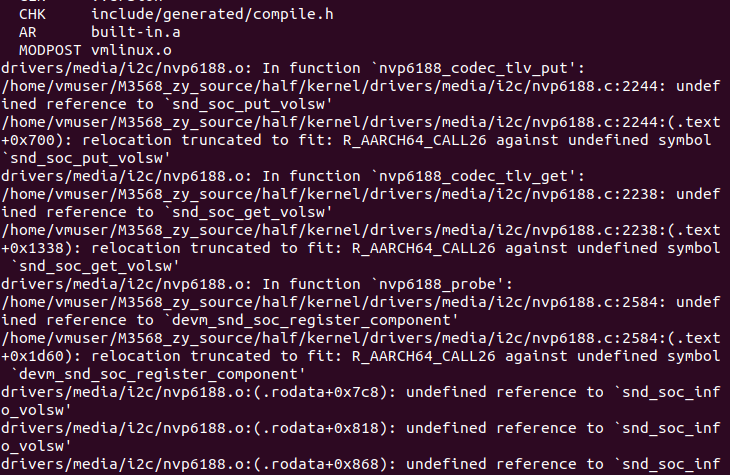

在使用 make modules 命令编译内核时，所有设置 为的项将被编译。make modules 结束后可以使用下面的命令安装内核中的可加载模块文 件到一个指定的目录：  make modules_install INSTALL_MOD_PATH=/home/usr/modules 

使用 make 命令编译内核相当于执行 make zImage 和 make modules 两个命令

## 移除模块

| 模块                                    | 编译是否通过 | 运行是否正常  |
| --------------------------------------- | ------------ | ------------- |
| CAN bus subsystem support               | √            | √             |
| Bluetooth subsystem support             | √            | √             |
| PPP (point-to-point protocol) support   | √            | √             |
| Wireless LAN （WLAN）                   | √            | *（疑似没网） |
| KeyBoards                               | √            |               |
| Mice                                    | √            |               |
| SPI support                             | √            |               |
| Sound card support                      | *            |               |
| MMC/SD/SDIO card support                | √            |               |
| NFS client support & NFS server support | √            |               |
| ISO 9660 CDROM file system support      | √            |               |

 (Sound card support移除后出现以下问题)

解决办法：搜索nvp6818，移除该模块即可

