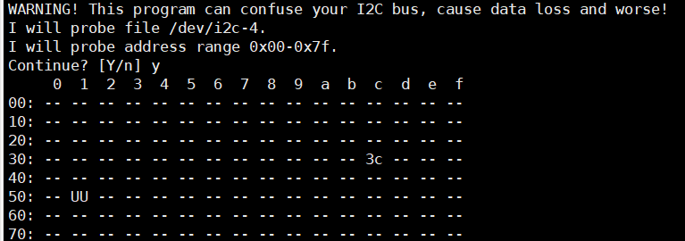
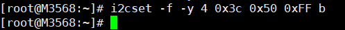

## 串口

验证方式：使用例程Blocking Master Example和Blocking Slave Example，分别收发多次

结论：无异常，开发板提供的串口默认为`ttyFIQ0`

## Socket

尝试移植了QWebSocket及boa，无异常

## IIC（无驱访问SSD1306 0.96 OLED）

 1、连接到牛角座，官方声明挂到/dev/i2c-4总线，直接无驱访问

2、通过i2cdetect查看是否存在设备

```bash
i2cdetect -a 4
```



插拔发现地址3c应该为iic设备（板上的I2C地址（0x78）是加上了第零位读写位后的数值，实际上是0x3c）

3、使用I2C-Tools检测读写状态

### I2c-Tools 说明

```bash
  /* i2cset */
  
  // 写一个字节: I2CBUS为0、1、2等整数, 表示I2C Bus; CHIP-ADDRESS表示设备地址
  //           DATA-ADDRESS就是要写的数据
  i2cset -f -y I2CBUS CHIP-ADDRESS DATA-ADDRESS
  
  // 给address写1个字节(address, value):
  //           I2CBUS为0、1、2等整数, 表示I2C Bus; CHIP-ADDRESS表示设备地址
  //           DATA-ADDRESS: 8位芯片寄存器地址; 
  //           VALUE: 8位数值
  //           MODE: 可以省略，也可以写为b
  i2cset -f -y I2CBUS CHIP-ADDRESS DATA-ADDRESS VALUE [b]
  
  // 给address写2个字节(address, value):
  //           I2CBUS为0、1、2等整数, 表示I2C Bus; CHIP-ADDRESS表示设备地址
  //           DATA-ADDRESS: 8位芯片寄存器地址; 
  //           VALUE: 16位数值
  //           MODE: w
  i2cset -f -y I2CBUS CHIP-ADDRESS DATA-ADDRESS VALUE w
  
  // SMBus Block Write：给address写N个字节的数据
  //   发送的数据有：address, N, value1, value2, ..., valueN
  //   跟`I2C Block Write`相比, 需要发送长度N
  //           I2CBUS为0、1、2等整数, 表示I2C Bus; CHIP-ADDRESS表示设备地址
  //           DATA-ADDRESS: 8位芯片寄存器地址; 
  //           VALUE1~N: N个8位数值
  //           MODE: s
  i2cset -f -y I2CBUS CHIP-ADDRESS DATA-ADDRESS VALUE1 ... VALUEN s
  
  // I2C Block Write：给address写N个字节的数据
  //   发送的数据有：address, value1, value2, ..., valueN
  //   跟`SMBus Block Write`相比, 不需要发送长度N
  //           I2CBUS为0、1、2等整数, 表示I2C Bus; CHIP-ADDRESS表示设备地址
  //           DATA-ADDRESS: 8位芯片寄存器地址; 
  //           VALUE1~N: N个8位数值
  //           MODE: i
  i2cset -f -y I2CBUS CHIP-ADDRESS DATA-ADDRESS VALUE1 ... VALUEN i
```

```bash
 /* i2cget */
 
 // 读寄存器
 //           I2CBUS为0、1、2等整数, 表示I2C Bus; CHIP-ADDRESS表示设备地址
 //           DATA-ADDRESS: 8位芯片寄存器地址; 
i2cget -f -y I2CBUS CHIP-ADDRESS DATA-ADDRESS
```




读写无异常

4、编写IIC无驱动应用程序，参考：

[用户态IIC编程 (zlg.cn)](https://manual.zlg.cn/web/#/171/6196)

设置从机地址（0x78 >> 1）和地址长度必不可少

此外，该模块具有写命令（0x00）和写数据（0x40）两种模式，提供api接口如下：

```c
void OLED_wrByte(u_int8_t data, u_int8_t mode)
{
	u_int8_t buf[2];
	buf[0] = mode;
	buf[1] = data;

	int ret = write(fd, buf, sizeof(buf));
	if(ret == -1)
	{
    	perror("failed to send byte");
	}
}
```

[例程](../src/iic_oled.c)

[说明文档](../doc/03经典款0.96寸OLED15pin规格书-.pdf)

[更多例程](../doc/01-0.96OLED显示屏STM32F103C8T6_IIC例程)

## GPIO

/sys/class/gpio目录下gpiochipXX对应GOIOX

```bash
cat /sys/class/gpip/label
```

排列序号的计算公式如下所示：

**GPIO排列序号=BANK×32+Mx8+N**

> 在公式中BANK为GPIO引脚所在的BANK，M和N一起组成该引脚在该BANK中的序号。以图1中GPIO1_D0为例，其BANK值为1，M为D，N值为0，因此排列序号为1*32+3x8+0=56。M里面A固定为0，B固定为1，C固定为2

```bash
gpio124 GPIO3_D4 // 5G PWR_ON_nOFF
gpio97 GPIO3_A1 // Power.SchDoc
gpio101 GPIO3_A5 // MINIPCIE FULL.SchDoc
gpio154 GPIO4_D2 // 5G 5G_nRST
```


