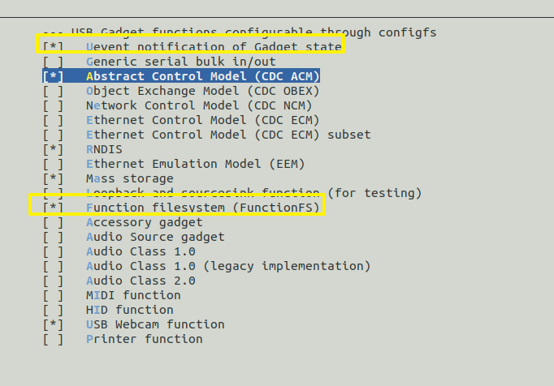
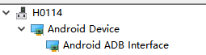
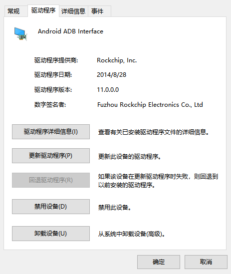
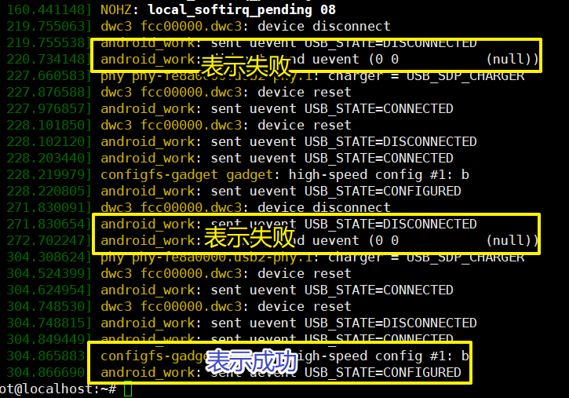

### arm-ubuntu镜像搭建

[(2条消息) 创建ubuntu根文件系统_平仄散人的博客-CSDN博客_ubuntu根文件系统制作](https://blog.csdn.net/qq_30624591/article/details/120083835?spm=1001.2101.3001.6650.3&utm_medium=distribute.pc_relevant.none-task-blog-2~default~CTRLIST~Rate-3-120083835-blog-105240490.pc_relevant_aa&depth_1-utm_source=distribute.pc_relevant.none-task-blog-2~default~CTRLIST~Rate-3-120083835-blog-105240490.pc_relevant_aa&utm_relevant_index=6)

[(2条消息) 制作arm ubuntu最小根文件系统，并安装软件_ubuntu 根文件制作_汉尼拔勇闯天涯的博客-CSDN博客](https://blog.csdn.net/hannibaychty/article/details/127149628)

[(2条消息) x86 Ubuntu上建立aarch64/arm64 Ubuntu的交叉编译链__R的博客-CSDN博客](https://blog.csdn.net/u012841922/article/details/121048387)

注意：sudo update-binfmts --enable qemu-aarch64，不注册环境，可能会出现chroot不可用的情况

挂载用mount.sh的脚本方便


[Ubuntu下如何解决apt Couldn't create temporary file (360doc.com)](http://www.360doc.com/content/22/1119/15/4240854_1056658926.shtml)

放入/etc/resolv.conf，以便联网apt-get

```bash
# This file is managed by man:systemd-resolved(8). Do not edit.
#
# This is a dynamic resolv.conf file for connecting local clients to the
# internal DNS stub resolver of systemd-resolved. This file lists all
# configured search domains.
#
# Run "resolvectl status" to see details about the uplink DNS servers
# currently in use.
#
# Third party programs must not access this file directly, but only through the
# symlink at /etc/resolv.conf. To manage man:resolv.conf(5) in a different way,
# replace this symlink by a static file or a different symlink.
#
# See man:systemd-resolved.service(8) for details about the supported modes of
# operation for /etc/resolv.conf.

nameserver 127.0.0.53
options edns0 trust-ad
```

放入/etc/apt/sources.list镜像源

```bash
deb http://mirrors.tuna.tsinghua.edu.cn/ubuntu-ports/ focal main restricted universe multiverse
# deb-src https://mirrors.tuna.tsinghua.edu.cn/ubuntu-ports/ focal main restricted universe multiverse
deb http://mirrors.tuna.tsinghua.edu.cn/ubuntu-ports/ focal-updates main restricted universe multiverse
# deb-src https://mirrors.tuna.tsinghua.edu.cn/ubuntu-ports/ focal-updates main restricted universe multiverse
deb http://mirrors.tuna.tsinghua.edu.cn/ubuntu-ports/ focal-backports main restricted universe multiverse
# deb-src https://mirrors.tuna.tsinghua.edu.cn/ubuntu-ports/ focal-backports main restricted universe multiverse
deb http://mirrors.tuna.tsinghua.edu.cn/ubuntu-ports/ focal-security main restricted universe multiverse
# deb-src https://mirrors.tuna.tsinghua.edu.cn/ubuntu-ports/ focal-security main restricted universe multiverse
```

可能出现报错

```bash
W: GPG error: http://mirrors.aliyun.com/ubuntu focal InRelease: Couldn't create temporary file /tmp/apt.conf.tE2HiT for passing config to apt-key
E: The repository 'http://mirrors.aliyun.com/ubuntu focal InRelease' is not signed.
```

解决：权限不足。`chmod 777 /tmp`即可


开始sudo apt-get install 软件

# 必备软件

| 软件名                | 作用                                                | 优先级 |
| --------------------- | --------------------------------------------------- | ------ |
| vim                   | 编辑文本                                            | ⭐⭐⭐⭐⭐  |
| net-tools             | ifconfig命令                                        | ⭐⭐⭐⭐   |
| openssh-server        | ssh服务                                             | ⭐⭐⭐⭐   |
| language-pack-zh-hans | 系统就知道zh_CN.UTF-8了，这个时候用perl就不会报错了 | ⭐⭐⭐⭐   |
| inputils-ping         | ping命令                                            | ⭐⭐⭐⭐   |
| kmod                  | lsmod insmod等操作                                  | ⭐⭐⭐⭐   |
| usbutils              | lsusb等操作                                         | ⭐⭐⭐⭐   |
| netplan.io            | ubtuntu网络配置，systemd相关                        | ⭐⭐⭐⭐   |
| udev                  |                                                     | ⭐⭐⭐⭐⭐  |
| lrzsz                 | rz，xshell透传                                      | ⭐⭐⭐    |
| （以下是level-1）     |                                                     |        |
| psmisc                | killall命令                                         | ⭐⭐⭐    |

烧录后发现，问题及解决方式：

[a start job is running for dev-ttyFIQ0.device问题 - Firefly-RK3399 - Firefly开源社区a start job is running for dev-ttyFIQ0.device问题 (t-firefly.com)](https://dev.t-firefly.com/thread-52761-1-1.html)


# 了解systemd

/usr/lib/systemd/network 系统网络目录 低优先

/run/systemd/network 运行时网络目录 中优先

/etc/systemd/network 本机网络目录 高优先

### systemctl 接管网络服务

[(34条消息) ubuntu开机启动网络配置 - systemd-networkd或netplan_就是个linux工程师的博客-CSDN博客_networkd ubuntu](https://blog.csdn.net/yanceylu/article/details/115284473)

```bash
systemctl enable systemd-networkd
```

```bash
vi /etc/systemd/network/10-static-eth0.network
```

```bash
[Match]
Name=eth0

[Network]
Address=192.168.4.210/24
DNS=8.8.8.8
Gateway=192.168.4.1
```


# 了解USB-Gadget

USB Gadget 是运行在USB Peripheral 上配置USB功能的子系统，正常可被枚举的USB设备至少有3层逻辑
层，有些功能还会在用户空间多跑一层逻辑代码。Gadget API就是具体功能和硬件底层交互的中间层。

| 功能                                                         | 配置项                                                    | 说明                                                         |
| ------------------------------------------------------------ | --------------------------------------------------------- | ------------------------------------------------------------ |
| **RNDIS**（Remote Network Driver Interface Specification）   | CONFIG_USB_CONFIGFS_RNDIS                                 | RNDIS提供基于USB的网络接口规范，可以使用网络命令（SSH等）实现Device和Host（如PC）的数据交互。 |
| **ADB** (Android Debug Bridge)                               | 基础配置即可？                                            | ADB是一种功能多样的命令行调试工具，可以实现文件传输，Unix Shell登录等功能。 |
| USB-Serial                                                   | CONFIG_USB_CONFIGFS_SERIAL                                | 可实现多路USB串口                                            |
| UMS（USB Mass Storage）                                      | CONFIG_USB_CONFIGFS_MASS_STORAGE                          | UMS 给Host设备（如PC）提供大容量外挂存储。                   |
| UAC （USB Audio Class）                                      | CONFIG_USB_CONFIGFS_F_UAC1<br/>CONFIG_USB_CONFIGFS_F_UAC2 | UAC通过USB虚拟标准PCM接口给Host设备，实现Device和Host之间音频互传功能。<br/>UAC分为UAC1和UAC2，UAC2和UAC1有以下区别：<br/>UAC2比UAC1具有更高的带宽（各平台实现略有不同，以实测为准）<br/>Windows 7及部分Windows 10系统默认不支持UAC2，需要手动安装驱动，但都支持UAC1 |
| MTP （Media Transfer Protocol）                              | CONFIG_USB_CONFIGFS_F_MTP                                 | MTP是由Microsoft提出的一套媒体文件传输协议，可以方便的在Device和Host之间共享媒体文件。 |
| ACM（CDC - ACM: Communication Device Class - Abstract Control<br/>Model） | CONFIG_USB_CONFIGFS_ACM                                   | 可以理解为USB虚拟串口，在Device/Host两端生成TTY设备。        |
| UVC (USB Video Class)                                        |                                                           |                                                              |

详细参考：[Rockchip_Quick_Start_Linux_USB_Gadget_CN](../doc/Rockchip_Quick_Start_Linux_USB_Gadget_CN.pdf)

### RK3568平台 USB-Gadget

基础配置：(黄框)



USB-Gadget脚本 S50usbdevice：[本地链接](../doc/S50usbdevice)

adb（免安装，设置环境变量即可）：(如 D:\adb\platform-tools)

> Windows版本：https://dl.google.com/android/repository/platform-tools-latest-windows.zip
> Mac版本：https://dl.google.com/android/repository/platform-tools-latest-darwin.zip
> Linux版本：https://dl.google.com/android/repository/platform-tools-latest-linux.zip

#### **ADB** (Android Debug Bridge)

装好rockchip相关驱动

adbd可执行程序：[本地链接](../doc/adbd)

```bash
echo usb_adb_en > /tmp/.usb_config
/etc/init.d/S50usbdevice restart
```







ADB调试常见问题：[ADB调试（Windows） (zlg.cn)](https://manual.zlg.cn/web/#/171/8895)

#### RNDIS（Remote Network Driver Interface Specification）

以ubuntu systemctl为例：

```bash
/lib/systemd/system/USB-Gadget-RNDIS.service
```

```bash
[Unit]
Description=RNDIS provides a USB-based network interface specification, and can use network commands (SSH, etc.) to realize data interaction between Device and Host

[Service]
ExecStart=/etc/init.d/RNDIS.sh

[Install]
WantedBy=multi-user.target
```

```bash
/etc/init.d/RNDIS.sh
```

```bash
#!/bin/bash

echo usb_rndis_en > /etc/init.d/.usb_config
echo usb_rndis_en > /tmp/.usb_config
/etc/init.d/S50usbdevice restart
ifconfig usb0 169.254.216.27
```

使能服务：

```bash
root@localhost:~# systemctl enable USB-Gadget-RNDIS
root@localhost:~# systemctl status USB-Gadget-RNDIS
● USB-Gadget-RNDIS.service - RNDIS provides a USB-based network interface specification, and can use network commands (SSH, etc.) to realize data interaction between Device
 and Host
     Loaded: loaded (/lib/systemd/system/USB-Gadget-RNDIS.service; enabled; vendor preset: enabled)
     Active: inactive (dead) since Wed 2023-02-15 11:41:01 CST; 2h 0min ago
   Main PID: 188 (code=exited, status=0/SUCCESS)

...
```
