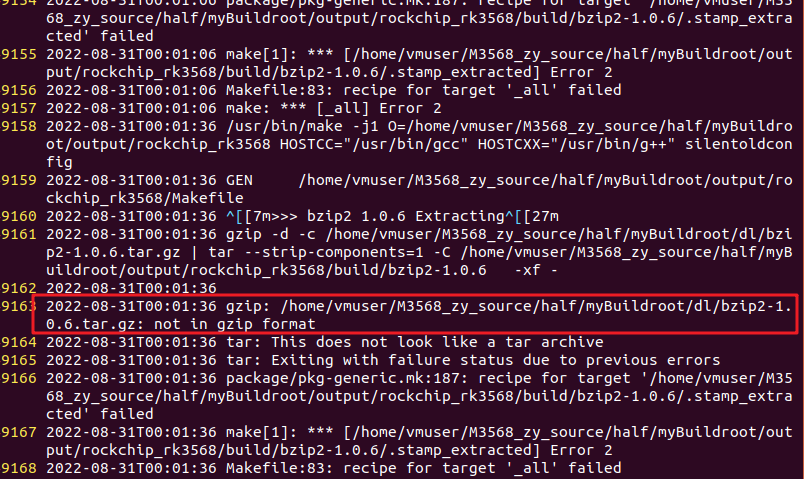
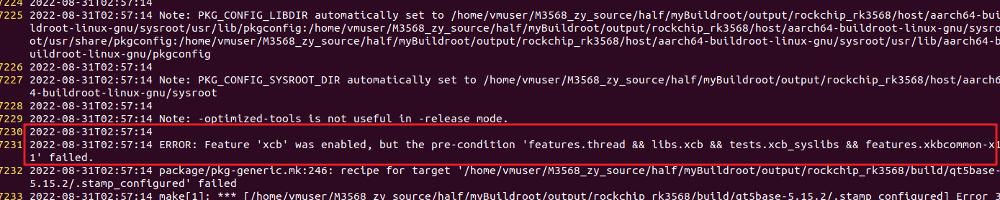
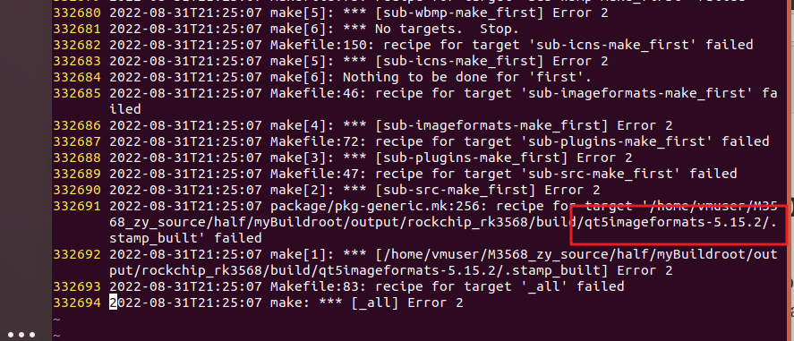
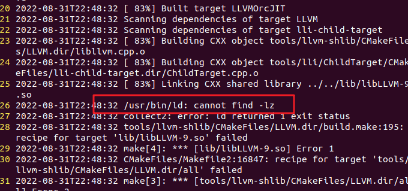

[Buildroot 开发 — Firefly Wiki (t-firefly.com)](https://wiki.t-firefly.com/AIO-3399C/buildroot_develop.html)

[(91条消息) 全志平台BSP裁剪（6）附件三--rootfs menuconfig配置说明_szembed的博客-CSDN博客](https://blog.csdn.net/szembed/article/details/124843153)

# 裁剪

注意：移除某个模块以后，再次加载时需要重新配置

| 模块                                | 编译是否通过 | 运行是否正常 |
| ----------------------------------- | ------------ | ------------ |
| MMP(Multimedia Processing Platform) |              |              |
| rkwifibt                            |              |              |
| qcamera                             |              |              |
| qplayer                             |              |              |
| multivideo player                   |              |              |
| alsa-config                         |              |              |
| alsa-utils                          |              |              |
| alsa-plugins                        |              |              |
| ffmpeg                              |              |              |
| gstreamer 1.x                       |              |              |
| faad2                               |              |              |
| mpg123                              |              |              |
| cifs-utils（samba相关）             |              |              |
| nfs-utils（nfs相关                  |              |              |
| libmad                              |              |              |
| libnfs                              |              |              |
| libv4l                              |              |              |
| libmpeg2                            |              |              |
| libyuv                              |              |              |
| can-utils                           |              |              |
| wireless tools                      |              |              |
| wpa_supplicant                      |              |              |
|                                     |              |              |
|                                     |              |              |
|                                     |              |              |

# 加载

| 模块     | 编译是否通过 | 运行是否正常 |
| -------- | ------------ | ------------ |
| valgrind |              |              |
| tree     |              |              |
| quazip   |              |              |
|          |              |              |
|          |              |              |
|          |              |              |
|          |              |              |
|          |              |              |
|          |              |              |
|          |              |              |
|          |              |              |
|          |              |              |
|          |              |              |
|          |              |              |
|          |              |              |

[Audio and video applications --->](http://wiki.100ask.org/Buildroot_Audio_and_video_applications)`此页主要介绍buildtroot支持的音频和视频应用功能介绍以及如何配置使用`

[Compressors and decompressors --->](http://wiki.100ask.org/Buildroot_Compressors_and_decompressors)`此页主要介绍buildtroot支持的压缩和解压应用简介以及如何配置使用`

[Debugging profiling and benchmark --->](http://wiki.100ask.org/Buildroot_Debugging_profiling_and_benchmark)`此页面主要介绍buildroot 调试、分析和基准测试应用的简介以及如何配置使用。`

[Development tools --->](http://wiki.100ask.org/Buildroot_Development_tools)`此页面主要介绍buildroot支持在目标系统上的开发工具应用的简介以及如何配置使用。`

[Filesystem and flash utilities --->](http://wiki.100ask.org/Buildroot_Filesystem_and_flash_utilities)`此页面主要介绍buildroot支持在目标系统上的文件系统和闪存实用程序的简介以及如何配置使用。`

[Fonts cursors icons sounds and themes --->](http://wiki.100ask.org/Buildroot_Fonts_cursors_icons_sounds_and_themes)`此页面主要介绍buildroot支持在目标系统上的字体，游标，图标，声音和主题的简介以及如何配置使用。`

[Games --->](http://wiki.100ask.org/Buildroot_Games)`此页面主要介绍buildroot支持在目标系统上的游戏 以及如何配置使用。`

[Graphic libraries and applications --->](http://wiki.100ask.org/Buildroot_Graphic_libraries_and_applications)`此页面主要介绍buildroot支持在目标系统上的图形库和应用程序(图形/文本)的简介以及如何配置使用。`

[Hardware handling --->](http://wiki.100ask.org/Buildroot_Hardware_handling)`此页面主要介绍buildroot支持在目标系统上的硬件处理应用/工具的简介以及如何配置使用。`

[Interpreter languages and scripting --->](http://wiki.100ask.org/Buildroot_Interpreter_languages_and_scripting)`此页面主要介绍buildroot支持在目标系统上的编程语言和脚本的简介以及如何配置使用。`

[Libraries --->](http://wiki.100ask.org/Buildroot_Libraries)`此页面主要介绍buildroot支持在目标系统上的库的简介以及如何配置使用。`

[Mail --->](http://wiki.100ask.org/Buildroot_Mail)`此页面主要介绍buildroot支持在目标系统上的邮箱应用的简介以及如何配置使用。`

[Miscellaneous --->](http://wiki.100ask.org/Buildroot_Miscellaneous)`此页面主要介绍buildroot支持在目标系统上的一些杂项应用的简介以及如何配置使用。`

[Networking applications --->](http://wiki.100ask.org/Buildroot_Networking_applications)`此页面主要介绍buildroot支持在目标系统上的网络应用程序的简介以及如何配置使用。`

[Package managers --->](http://wiki.100ask.org/Buildroot_Package_managers)`此页面主要介绍buildroot支持在目标系统上的 包管理 应用的简介以及如何配置使用。`

[Real-Time --->](http://wiki.100ask.org/Buildroot_Real-Time)`此页面主要介绍buildroot支持在目标系统上的 实时时钟 的简介以及如何配置使用。`

[Security --->](http://wiki.100ask.org/Buildroot_Security)`此页面主要介绍buildroot支持在目标系统上的 实时时钟 的简介以及如何配置使用。`

[Shell and utilities --->](http://wiki.100ask.org/Buildroot_Shell_and_utilities)`此页面主要介绍buildroot支持在目标系统上的 Shell和程序 的简介以及如何配置使用。`

[System tools --->](http://wiki.100ask.org/Buildroot_System_tools)`此页面主要介绍buildroot支持在目标系统上的 系统工具 的简介以及如何配置使用。`

[Text editors and viewers --->](http://wiki.100ask.org/Buildroot_Text_editors_and_viewers)`此页面主要介绍buildroot支持在目标系统上的 文版编辑和浏览工具 的简介以及如何配置使用`

# 编译时遇到的问题汇总



gzip无法识别bzip2-1.0.6.tar.gz，并不是因为不支持，而是这个包丢包了，自行去官网下载并替换到dl即可

[bzip2 download | SourceForge.net](https://sourceforge.net/projects/bzip2/)



直接不要xcb这个库，简单暴力



不要imageformats



apt安装libz-dev即可

如遇到没有提示具体错误的报错，如build-clang的编译出错，可能是内存不够

[(93条消息) 解决编译时内存不足c++: internal compiler error: Killed (program cc1plus)_麦田里的守望者_zhg的博客-CSDN博客_编译内存不足](https://blog.csdn.net/qq_33521184/article/details/123120704)

[(93条消息) Ubuntu学习笔记：swapon 失败：设备或资源忙_小马啵啵的博客-CSDN博客_swapon 失败: 设备或资源忙](https://blog.csdn.net/qq_53850321/article/details/121235918)


```bash
sudo cp ../0800rootfs/m3568/usr/share/at503/ usr/share/. -r
sudo cp ../0800rootfs/m3568/etc/network/interfaces etc/network/interfaces
```


编译完成后，发现qt缺少了webchannel，所以再编译一下

